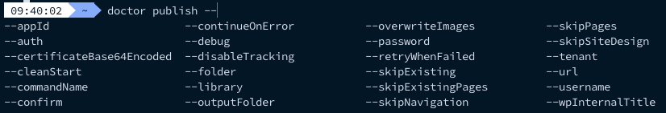

`doctor` is a command line tool. This section describes every command it offers. The arguments you can pass to these commands are documented in the [CLI options](../configuration/cli-options) section.

| Command | What it does |
| --- | --- |
| [`doctor init`](#init) | Creates the initial folder structure and the `doctor.json` file. |
| [`doctor publish`](#publish) | Publishes your Markdown files as pages on your SharePoint site. |
| [`doctor status`](#status) | Shows what the next publish run will do, without changing anything. |
| [`doctor workflow`](#workflow) | Generates a GitHub Actions workflow for your project. |
| [`doctor setup`](#setup) | Installs the `<tab>` autocomplete functionality. |
| [`doctor cleanup`](#cleanup) | Uninstalls the autocomplete functionality. |
| [`doctor version`](#version) | Returns the installed version number. |

> **Info**: When you run `doctor` without any command, it asks you which command you want to execute.

## Init

This command creates the initial folder structure for your documentation project (Check [CLI options](../configuration/cli-options) to see which arguments you can pass to the command).

### Examples

Initialize a standard project:

```sh
doctor init
```

Initialize a project with the details of your app registration:

```sh
doctor init --url <url> --appId <appId> --tenant <tenant>
```

The command creates the following in the current folder:

- The source folder (`./src` by default, or the one you passed with `-f, --folder`).
- An `index.md` starter page in that folder, when it does not exist yet.
- A `doctor.json` file, when it does not exist yet, containing the `$schema`, `auth`, `url`, `folder`, `overwriteImages`, `library`, and `webPartTitle` values. The `appId` and `tenant` values are added when you passed them.

> **Important**: `doctor init` never writes your `certificate` or its `password` to the `doctor.json` file, as these are secrets which are best kept out of source control. Pass them on each command execution, ideally from a secret in your CI/CD pipeline. Check the [certificate authentication](../getting-started/certificate-authentication) section for more information.

> **Info**: Existing files are never overwritten, so it is safe to run `doctor init` again in an existing project.

## Publish

The publish command starts the creation process of your static content in SharePoint. It will upload all referenced images and creates the navigation structure if provided (Check [CLI options](../configuration/cli-options) to see which arguments you can pass to the command).

### Examples

When using a `doctor.json` file, you can just run the doctor publishing command:

```sh
doctor publish
```

If you want to manually pass your arguments, you can do this as follows:

```sh
doctor publish --url https://<tenant>.sharepoint.com/sites/<documentation>
```

## Status

The `doctor status` command is a read-only command which compares your local markdown files against the publish state stored in SharePoint. It tells you what the next `doctor publish` run will do, without making any changes to your site.

```sh
doctor status
```

> **Important**: The command requires the `--url` option (either passed as an argument, or defined in the `doctor.json` file), as it needs to download the state file from your site.

The output groups your pages in the following categories:

- **New**: files which are not yet tracked in the state, and will be created.
- **Modified**: files whose content changed since the last publish, and will be updated.
- **Deleted**: pages which are tracked in the state, but no longer exist locally.
- **Unchanged**: files which are up to date. These are only listed when you pass the `--verbose` flag.

At the end, you get a summary telling you how many pages will be published on the next run:

```
 ⚡ 4 pages will be published on next run
```

> **Info**: When state persistence is disabled with `--disableStatePersistence`, no state gets loaded and all pages are reported as **New**.

> **Info**: The `status` command always reports the real difference with the state. The `forceAll` option is ignored here, as it only influences what `doctor publish` reprocesses.

Pages of the `translation` type, and pages without a `title` in their front matter, are not included in the comparison.

## Workflow

The `doctor workflow` command generates a [GitHub Actions](../ci-cd) workflow which publishes your documentation.

```sh
doctor workflow
```

The command creates the `.github/workflows` folder when it does not exist yet, and writes a `doctor.yml` workflow file in it. The workflow runs when you push a change to the `main` branch, and can be started manually via the `workflow_dispatch` trigger.

The generated workflow only passes the arguments which are not known yet. When your `doctor.json` file already contains the `url`, `appId`, and `tenant` values, these are left out of the `doctor publish` command, as `doctor` picks them up from the config file itself.

Add the following secrets to your repository before running the workflow:

| Secret | Description |
| --- | --- |
| `CERTIFICATE` | The base64 encoded contents of your certificate (`.pfx`, `.p12`, or `.pem`). |
| `CERTIFICATE_PASSWORD` | The password of your certificate. |
| `APP_ID` | The client ID of your Entra ID app registration. Only needed when `appId` is not in your `doctor.json` file. |
| `TENANT_ID` | The ID of your tenant. Only needed when `tenant` is not in your `doctor.json` file. |
| `SITE_URL` | The URL of the SharePoint site to publish to. Only needed when `url` is not in your `doctor.json` file. |

> **Info**: An existing `.github/workflows/doctor.yml` file is never overwritten. Delete or rename it when you want to generate a new one.

> **Important**: The generated workflow is a starting point. Change the branch, the path filter, or the arguments of the `doctor publish` command to match the way you work.

## Setup

The `doctor setup` command allows you to initialize the autocomplete functionality (`<tab>` completion) for `doctor`.

### Example

```
doctor setup
```

When you now type, `doctor <tab>` you will get a list of available commands and/or related arguments.



## Cleanup

The `doctor cleanup` command is there to uninstall the autocomplete functionality from `doctor`.

> **Important**: You do not need to use it if you never ran the `doctor setup` command.

## Version

This command returns the installed version number of the tool.

```sh
doctor version
```

## Help

Running `doctor` with the `--help` argument shows the version you are running and the list of supported commands.

```sh
doctor --help
```
