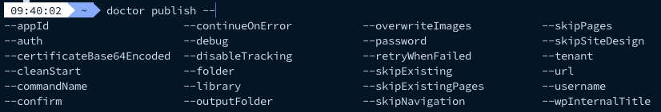

### Cleanup

The `doctor cleanup` command is there to uninstall the autocomplete functionality from `doctor`. 

> **Important**: You do not need to use it if you never ran the `doctor setup` command.

### Version

This command returns the installed version number of the tool.

```sh
doctor version
```

### Init

This command creates the initial folder structure for your documentation project (Check [#Options](../options) to see which arguments you can pass to the command).

#### Examples

Initialize a standard project:

```sh
doctor init
```

Initialize a project with your own options:

```sh
doctor init --auth password --username <username> --password <password>
```

### Publish

The publish command starts the creation process of your static content in SharePoint. It will upload all referenced images and creates the navigation structure if provided (Check [#Options](../options) to see which arguments you can pass to the command).

#### Examples

When using a `doctor.json` file, you can just run the doctor publishing command:

```sh
doctor publish
```

If you want to manually pass your arguments, you can do this as follows:

```sh
doctor publish --url https://<tenant>.sharepoint.com/sites/<documentation>
```

### Setup

The `doctor setup` command allows you to initialize the autocomplete functionality (`<tab>` completion) for `doctor`.

#### Example

```
doctor setup
```

When you now type, `doctor <tab>` you will get a list of available commands and/or related arguments.

