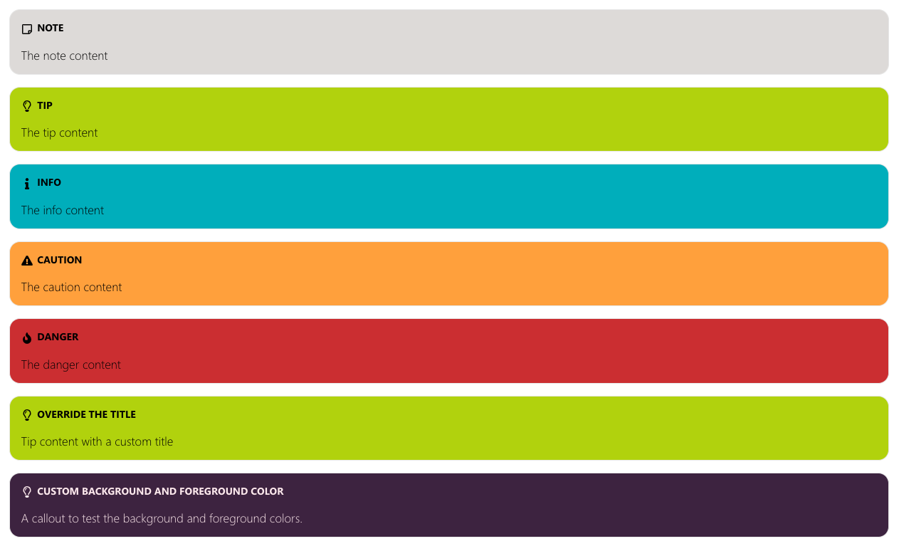

The `callout` allow you to highlight certain parts of your documentation.



Example:

```html
<callout type="note">The note content</callout>

<callout type="tip">The tip content</callout>

<callout type="info">The info content</callout>

<callout type="caution">The caution content</callout>

<callout type="danger">The danger content</callout>

<callout type="tip" title="Override the title">Tip content with a custom title</callout>

<callout type="tip" title="Custom background and foreground color" bgColor=#462749" fgColor="#FDECEF">A callout to test the background and foreground colors.</callout>
```

The following HTML attributes are supported for the `callout`:

- **type**: 
  - note
  - tip
  - info
  - caution
  - danger
- **title**: Allows you to specify a custom callout title
- **bgColor**: Allows you to specify a custom background color
- **fgColor**: Allows you to specify a custom foreground color