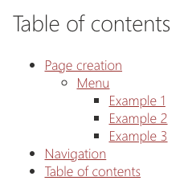

The `toc` shortcode allows you to include a table of contents for the current page to easily link to sections/headers on your page.



> **Important**: Make sure that you have a logical heading structure. For instance: `H2, H3, H2, H2, H3, H4`.

Example:

```html
<toc />
```

## Attributes

The table of contents has the following:

- `title`: Allows you to set the title above the table of contents (optional).
- `position`: If not provided, the table of contents will appear where you have inserted it into the Markdown. If you want to show a **sticky** table of contents, you can provide the `left` or `right` value.


Example:

```html
<toc title="Table of contents" position="right" />
```

## Global options

You can set the heading levels to be included/excluded in the `tocLevels` option in your `doctor.json` file.

```json
{
  "markdown": {
    "tocLevels": [1, 2, 3, 4]
  }
}
```
