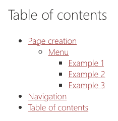

The `toc` shortcode allows you to include a table of contents for the current page to easily link to sections/headers on your page.



:::caution[Important]
Make sure that you have a logical heading structure. For instance: `H2, H3, H2, H2, H3, H4`.
:::

Example:

```html
<toc />
```

## Attributes

The table of contents has the following:

- `title`: Allows you to set the title above the table of contents (optional).
- `position`: If not provided, the table of contents will appear where you have inserted it into the Markdown. Set it to `right` to show a **sticky** table of contents next to the content, on screens at least 1024 pixels wide. `right` is the only position there is.


Example:

```html
<toc title="Table of contents" position="right" />
```

:::caution[Important]
A table of contents cannot be used on a page with a [web part shortcode](../webpart/): that page is published as several web parts, and each would only list its own headings. `Doctor` stops with an error on such a page.
:::

## Global options

You can set the heading levels to be included in the [`markdown.tocLevels`](../../../configuration/doctor-json/#markdown-publishing-settings) option in your `doctor.json` file. The default is `[1, 2, 3, 4]`.

```json
{
  "markdown": {
    "tocLevels": [1, 2, 3, 4]
  }
}
```
