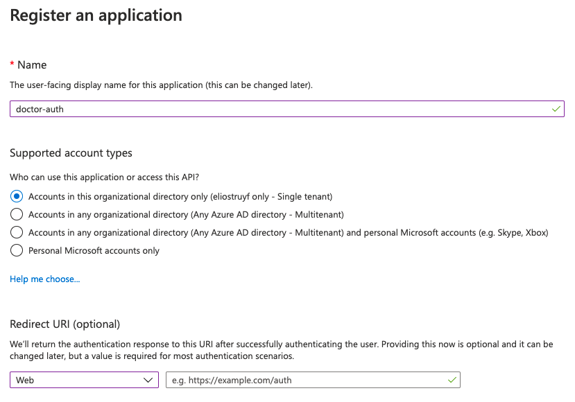
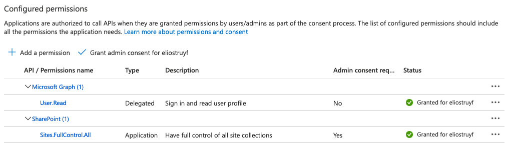
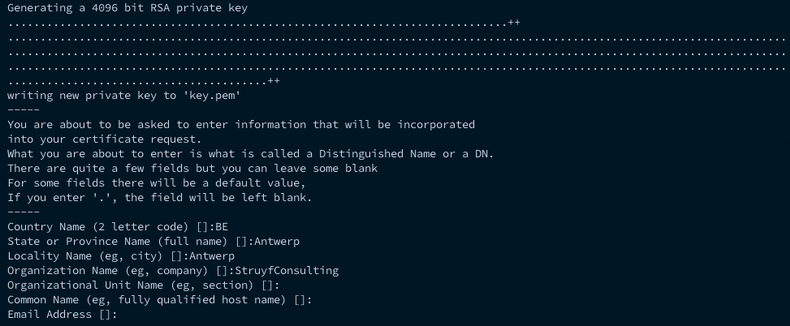
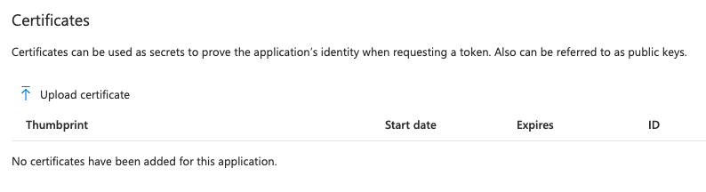

Certificate authentication is the only authentication type `doctor` supports. `doctor` does not come with an application of its own, so you need to create your own **Azure Entra ID app registration** and authenticate with its certificate. Follow the next steps before you start using `doctor`.

:::caution[Important]
Since v2.0.0 the `deviceCode` and `password` authentication types are removed. Certificate authentication uses application permissions, which work for every API `doctor` calls, and it is the only type which can run unattended in a CI/CD pipeline.
:::

## Create the Entra ID app registration

- Go to your [Azure Portal](https://portal.azure.com)
- Open **Microsoft Entra ID**
- Click on **App registrations**
- Click on **New registration**
- Specify a name for your new Entra ID app



- Once the app is created, click on **API Permissions** and add the **Sites.FullControl.All** application permission scope from SharePoint



- Click on **Grant admin consent for <tenant>**, and accept

### Scoping the app to a single site

**Sites.FullControl.All** grants the app rights on **every** site in the tenant. If you would rather
give it access to only the site you publish to, add the **Sites.Selected** application permission
instead of `Sites.FullControl.All`, grant admin consent for it, and then grant the app rights on that
one site. With [PnP PowerShell](https://pnp.github.io/powershell/), as a tenant administrator:

```powershell
Connect-PnPOnline -Url https://<tenant>.sharepoint.com/sites/<site> -Interactive

Grant-PnPAzureADAppSitePermission `
  -AppId <appId> `
  -DisplayName "<app name>" `
  -Permissions FullControl `
  -Site https://<tenant>.sharepoint.com/sites/<site>
```

`FullControl` on the site is what lets `doctor` do everything it can do: publish pages, set their
metadata, and manage the site navigation, the theme, the header and footer and the site logo — those
last ones need **Manage Web** rights, which `Write` does not include.

`Write` is enough to publish pages and set their metadata, and is the right choice when you do not
want the app to be able to change the look of the site.

Either way `doctor` reports what the account may and may not do before it writes anything, and skips
the site-level steps it is not allowed to take rather than failing the run — see
[available permissions](../../configuration/cli-options/#available-permissions).

## Create and upload the certificate

- Open a command prompt, and run the following command in order to generate a certificate: `openssl req -x509 -newkey rsa:4096 -keyout key.pem -out cert.pem -days 366 -nodes`



- Upload the **cert.pem** file to the Entra ID app under **Certificates & secrets**



- Converted the certificate into the `PKCS` format using `openssl pkcs12 -export -out cert.pfx -inkey key.pem -in cert.pem`
  - It will ask for a password. This is yours to pick. Be aware, if you specify a password, you will also need to pass it to the `doctor` command with the `--password <password>` argument.

## Use the certificate with doctor

Once you did the previous steps, you are ready to make use of the `doctor` tool. Pass the certificate with the `--certificate <certificate>` argument, which accepts the **path to your certificate file**, or its **base64 encoded contents**.

#### Using the path to the certificate file

Point the `--certificate` argument to your `cert.pfx` file. The path is relative to the folder from where you run `doctor`.

```sh
doctor publish --certificate ./cert.pfx --appId <appId> --tenant <tenant> --url <url>
```

Next to `.pfx`, the `.p12` and `.pem` extensions are supported as well.

#### Using the base64 encoded certificate

This is the easiest option to use in a CI/CD pipeline, as you can store the certificate as a secret.

- Get the `base64` string from the `pfx` file. Execute: `cat cert.pfx | base64`
- Use the `Base64` output as the input for the `--certificate <certificate>` argument.

```sh
doctor publish --certificate <base64String> --appId <appId> --tenant <tenant> --url <url>
```

:::note[Info]
When you specified a password while creating the certificate, you also need to pass it with the `--password <password>` argument.
:::

:::note[Info]
You can store the `appId` and `tenant` settings in the `doctor.json` file, so you do not need to repeat them on every run. More information can be found under the [doctor.json](../../configuration/doctor-json) section.
:::

:::caution[Important]
Keep the `certificate` and its `password` out of the `doctor.json` file when you commit it to source control. Pass them on the command line from a secret instead.
:::
